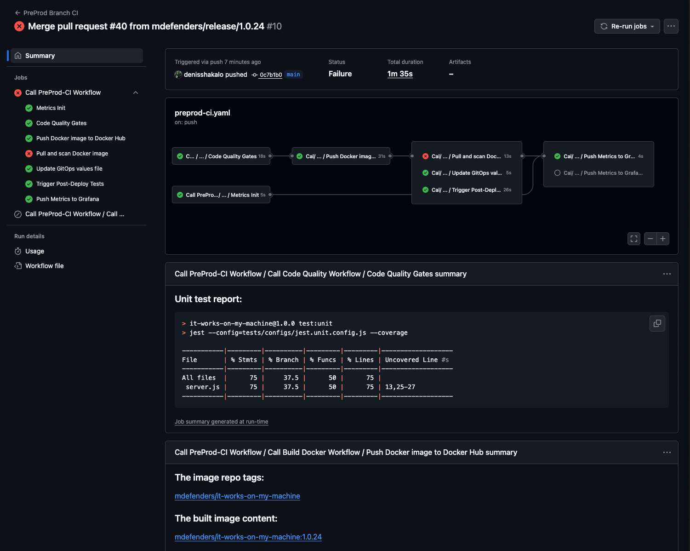
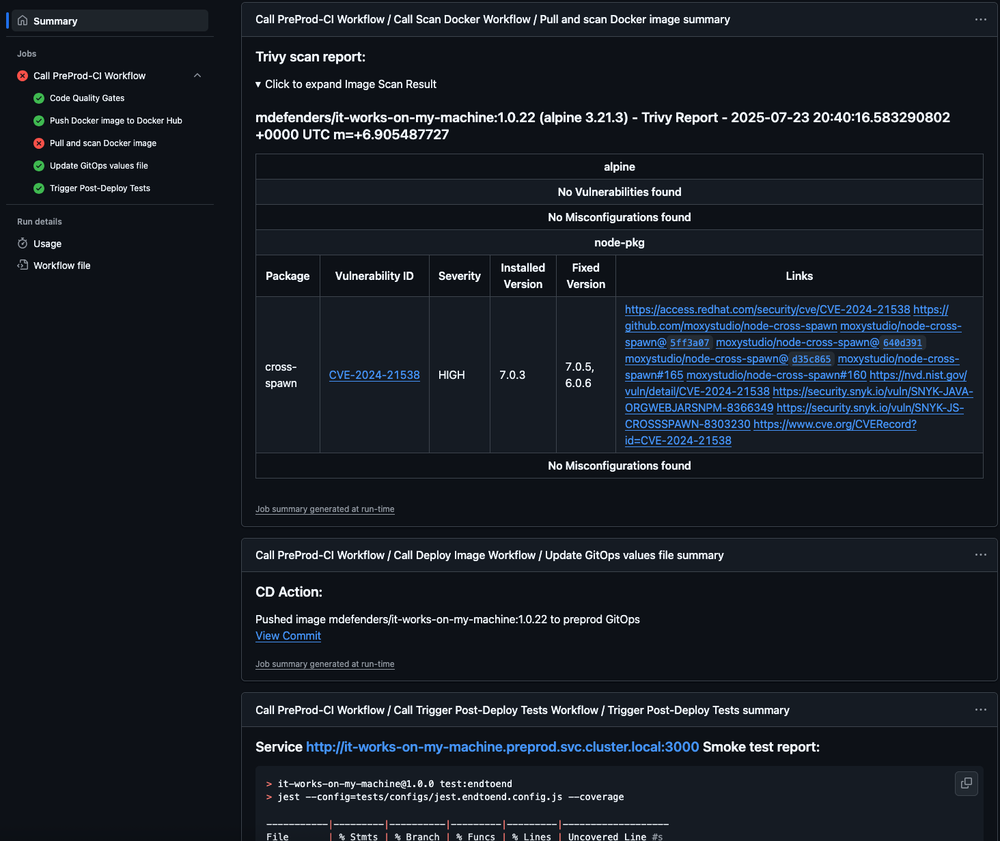

# Brief Developer Onboarding Guide

The CI/CD developed with goal to make your work easier and more productive. Feel free to ping the team and share you
ideas how to improve it.

## Overview

The flow is based on [GitFlow](https://www.atlassian.com/git/tutorials/comparing-workflows/gitflow-workflow) + PR
principles, using GitHub Actions for CI and a GitOps tool (e.g., ArgoCD, FluxCD) for CD. So your only tool to interact
with it for most use-cases is [Github UI](https://github.com/mdefenders/it-works-on-my-machine/).

## Promote your code from Feature Branch to Production

**Create a feature branch** from `develop` (e.g., `feature/my-awesome-feature`), make your changes, commit and push.
> CI/CD executes a pipeline dry-run, running code quality checks, unit tests, and dry-run docker build.

**Create and Merge** a Pull Request (PR) to `develop` branch.
> Code quality checks, unit tests, build and push to DockerHub the docker image, image security scan, deployment to the
> dev kubernetes cluster/namespace, regression/integration test. You will get the deployment notification, with links
> to the workflow run report accessible via GitHub UI and the deployed service URL

**Create a release branch** from `develop` (e.g., `release/1.2.3`) whar you are ready to release, merge the macter back
to it, and push.
> The same behavior as for the `develop` branch, but the service is deployed to the staging environment to allow new
> features development on dev, extended testing and polishing release on staging.

**Merge the release branch** to `main` and push.
> The same behavior as for the `release` branch, but:
> - release versioned image built from teh master branch commit
> - deployed to the pre-production environment, SRE can begin evaluating and adopting the release
> - final end-to end testing

**Trigger production deployment** by running the GitHub Action workflow manually.
> On this step the service is deployed to the production environment, with the GitOps tool (e.g., ArgoCD, FluxCD). Smoke
> tests are run to ensure the service is running and responsive. Release tag will be added to the repository. On smoke
> test failure the deployment is rolled back to the previously deployed version automatically by restoring the previous
> image tag in the GitOps repository.

**Hotfixes** are handled similarly to releases, but created from the `master` branch, allowing urgent fixes to be
deployed. Increase manually the patch version number on the hotfix branch creation. Merge hotfix branch back to develop
before removing to ensure the fix is available in the next release.

## Add tests

Under the tests folder you can find subfolders to add your unit, integration, and end-to-end tests. Now the simple unit
test is placed as a placeholder. CI/CD pipeline will run the tests, placed in the folders on corresponding promotion
stages. For integration tests, all services URLs are available via environment variables. Right now only the own service
URL is available for tests via the $SERVICE_URL environment variable

| Folder      | Stage         |
|-------------|---------------|
| unit        | All stages    |
| integration | Dev, Staging  |
| endtoend    | Preproduction |
| smoke       | Production    |

## Workflow Run Report

Open a workflow run with GitHub UI from the repo Actions tab, or from the notification you received after the
deployment.
There you can find:
- Workflow jobs graph, showing the pipeline steps and their status
- Testing results
- Link to built image in DockerHub
- Image vulnerability scan report (**Folded** by default to avoid noising the report)
- GitOps deployment manifests changes with commit links
- Direct links to build errors (if any)
- Direct link to the deployed service

[Example](https://github.com/mdefenders/it-works-on-my-machine/actions/runs/16481323482) of the workflow run report
> Only collaborators with write access (or higher) can view them in the GitHub UI.




## Notifications

> Read TL;DR or ping us for more details

# TL;DR

## Goals

- Deploy the service as a part of further microservices-based solution.
- Achieve zero-click deployment automation.
- Comprehensive CI/CD pipeline with automated testing and code quality gates.
- Reliable production deployment with rollback capabilities.

## Intentionally Out of Scope

Following features, required in the real world, were intentionally excluded because of complexity or just for time
saving, but may be implemented later keeping the current design:

- Support of different simultaneous feature builds of the service deployed in the development environment and multiple
  releases of the service deployed in the staging or production environments, Both features require
  service mesh or complicated deployments, which are beyond the scope of this assignment.
- Simpler feature branch switching may be implemented by external scripts to allow switching feature branches, deployed
  to dev environment, but it brakes the requirement of zero-click deployment automation. So it is not implemented.
- Blue/Green or Canary deployments. Kubernetes deployments rollout is sufficient for the current service to provide
  reliable deployments.
- Kubernetes infrastructure provisioning as IaC.
- Integration with other services for end-to-end tests on release deployment.
- New services onboarding automation.
- Promotion flow automation.
- Replacing bash code in CI/CD pipeline steps with custom GitHub Actions or well-supported community-provided Actions
  to make better maintainable and developer-friendly.
- Fixing reusable workflows with tagged version (@vX) instead of using `dev` reference.

## Architecture & Design

### Deployment Platform

The service is deployed as a Kubernetes Deployment, taking advantage of native features for scalability, reliability,
and observability.

- **Stateless** by design
- **Deployed using Helm** (chart included locally for demo)
- **GitOps-driven** rollout flow (e.g., ArgoCD, FluxCD-compatible)

Although in this demo the Helm chart is part of the repository, in production we recommend a centralized chart registry
for reusability.
> The Helm chart provided is very basic and clear example to demonstrate only CD-related features, not a full-fledged.
> It creates Kuberenets deployment with probes, no Ingress or Service resources, as they are not required for the demo.

### CI/CD & Promotion Flow

The service follows a Git-based promotion model:

```ascii
    +-------------+        Push        +------------------+
    | Developer   |------------------->|  feature/*       |
    +-------------+                    +------------------+
                                           | CI only
                                           | Unit tests 
                                           v Build dry-run
     Merge PR into                     +------------------+
     develop                           |   develop        |
                                       +------------------+
                                           | Build/push
                                           | Dev deploy
                                           v Regression/Integration
                                             tests
     Release branch created            +------------------+
     from develop                      |  release/x.y.z   |
                                       +------------------+
                                           | Build/push
                                           | Staging deploy
                                           v Integration tests
     Merge PR into                     +------------------+
     main                              |      main        |
                                       +------------------+
                                           | Build/push
                                           | Pre-Production deploy
                                           v End-to-End tests
     Prod depoy trigger                +------------------+
                                       |      main        |
                                       +------------------+
                                           | Tagging,
                                           | Production deploy
                                           v Smoke-tests                                           
                                      GitOps/CD system
                                      updates cluster
```

The flow have to be protected with branch protection rules to disable direct pushes to `develop`, `release/*` and `main`
branches, except GitHub Actions token.

- Developers work on features in `feature/*` branches, triggering CI checks
- Once a feature is ready, it is merged into `develop` and deployed to the development environment for integration
  testing
- New release branches (`release/x.y.z`) are cut from `develop` for staging QA
- On approval, merged into `main`, tagged (e.g., `v1.2.3`) to trigger pre-production deployment, extensive end-to-end
  tests
- Production release approved and GitOps deployment of the current approved release is triggered by manual pipeline run
- Hotfixes follow a similar flow via `hotfix/*` → `main` with intermediate staging deployment for testing
-

## CI/CD Pipeline Logic

### GitHub Actions (CI)

- Code quality checks (lint, unit tests, coverage threshold)
- Docker build
- Push image to container registry
- Update GitOps deployment manifests per environment (per branch logic)
- Run integration tests

### GitOps-based CD

- Git is the source of truth for deployments
- ArgoCD/FluxCD watches the GitOps repo and syncs desired state
- Deployment is handled via standard Kubernetes `Deployment` mechanics

> Rely on Kubernetes native rollout strategies (rolling update, readiness probes, health checks) for safe delivery.

## Repository & Branching Strategy

### Repository Layout

A **composite (monolith per service) repository** is used, combining:

- Application code
- Helm chart (for test assignment, in production use a centralized chart registry)
- GitOps deployment manifests

> Why: repository which combines both service code and its GitOps configuration per service
> - makes CI/CD pipelines simpler, allows build and deploy by one pipeline run
> - avoids build queuing and merge conflicts in GitOps manifests on parallel services builds
>
> For real projects pure monorepo or spited repo approach may be used depending on the project size and complexity.

### Branching Model

GitFlow model is used:

- `feature/*` — Feature development (CI only)
- `develop` — Integrated Dev testing (CI + Dev deployment)
- `release/*` — Pre-production QA (Staging deployment)
- `hotfix/*` — Urgent fixes (Staging + Prod deployment)
- `main` — Production-ready releases (Production deployment)

> Why: This model:
> - Well reflects the promotion flow chosen (see below)
> - May be easily extend to support multiple feature version deployed to dev and multiple releases deployed to
    staging/prod in the future

## Versioning Strategy

Composite strategy combining Git semantics and SemVer, depending on the promotion stage
versioned with:

- Dev builds: short commit SHA1 (`dev-<sha>`).
- Releases candidates/hotfixes: release/hotfix branch name and short commit SHA1 (e.g., `release|hotfix/1.2.3-rc-<sha>`)
- Releases: SemVer (e.g. `1.2.3`)

Builds and versions traceability:

On all stages versions are available in:

- docker image tags
- Kubernetes pods labels
- health check endpoints (`/health`)
- GitHub Action Workflow run reports (With actual DockerHub links)

On prod deployments a version tagg added to the git repository deployment commit.

> Why:
> - Using sha1 tagging fo dev builds allows to avoid noise in the repository with build tags and provides
    traceability
> - Using `version/package.json` versioning for releases allows to use standard npm versioning and
    semantic versioning, which is widely used in the Node.js ecosystem

## Code Quality Gates

Code Quality Gates are implemented via GitHub Actions Workflows, running on each push and checked on crucial branches
PRs (`develop`, `release/*`, `main`). For this testing assignment repo Branch protection rulles are **NOT** enabled
intentionally to demonstrate possible failures and avoid access control tuning for the action runners. For production
implementation direct branch merge to the branches above may be disabled fot strict Code Quality Gates reinforcement.

The strategy starts with fewer restrictions during early development to increase development velocity and gradually
increases enforcement as code is
promoted to higher environments.

- Lint (ESLint or equivalent)
- Code formatting
- Dependency security checks
- Unit & integration tests
- Test coverage threshold
- Image vulnerability scanning

## Rollback Strategy

Kubernetes Deployment resources are configured with:

- **Rolling updates** (default)
- **Readiness/liveness probes** for health validation
- **Rollback on failure** via post-deployment tests
- Manual rollback is possible by reverting GitOps image tag to a previous version

## 🔐 Secrets & Configuration

Secrets and environment-specific configuration are **not hardcoded**. In these would be managed via:

- GitHub Actions Secrets for CI/CD
- Kubernetes Secrets (possible with Vault operator or similar solutions) for deployed infrastructure and applications

## Source Code Improvements/Changes

### Dockerfile

```Dockerfile
COPY package*.json ./
RUN npm ci --only=production

COPY server.js .
```

- package-lock.json added to ensure consistent dependencies
- `npm ci` used for production builds to ensure a clean installation of dependencies.
- `COPY server.js .` added to copy the main application file into the image to avoid accidental addition of unnecessary
  files

### Dependencies

Dependabot added it to the repository to ensure dependencies are up-to-date safely

### Tests

Very basic unit test added as a placehplder for all kind of tests, which may be added later.

```javascript

### Health Checks

- Added basic HTTP health checks (/health) to the Kubernetes Deployment to ensure the service is running and responsive.
- /health endpoint returns the deployed build version and commit hash. I
- Configured the Deployment with a RollingUpdate strategy for safe and zero-downtime upgrades.

> If any security concerns, /health endpoint have to be secured.

## Testing strategy

The testing strategy is based on the following principles:

- **Unit tests**: On each code commit
- **Integration tests**: On develop build deplyoment to dev environment
- **End-to-end tests**: On release branch build deployment to staging environment
- **Smoke tests**: On production deployment to ensure the service is running and responsive

> The most challenging aspect of the testing strategy is reliably triggering integration, end-to-end, and smoke tests
> after the deployment rollout. The most robust solution involves configuring the CI/CD pipeline to query the Kubernetes
> or ArgoCD API to verify that the deployment has completed and the service is running before executing the tests.
> However, since the CI/CD pipeline in this context cannot access the Kubernetes API, alternative approaches were
> evaluated.

> One option considered was pushing deployment status metrics from the running service to a public endpoint—such as the
> free tier of Grafana Cloud. However, this solution was deemed neither reusable nor sufficiently reliable and partially
> manual. As a result, the final approach involved mocking Kubernetes API/CLI calls to simulate a successful deployment,
> allowing the tests to proceed as if the rollout had completed.

> In the real world scenario, kubectl cli have to be replaced with custom GitHub Action to make Kubernetes API calls.

## GitHub Organization/Repo configuration

- Set develop branch as the default branch

## Summary

This project showcases:

- GitHub Actions CI integrated with GitOps CD
- A realistic branching and promotion model
- Standardized release/versioning flow
- Kubernetes-native deployment strategies
- Clear separation of dev/staging/prod environments

While scoped down, the approach is **modular, scalable, and production-aware** — a solid starting point for a full
microservice platform.

## Local Kubernetes deployment

You can test the deployment locally using following:

- Install local Kubernetes cluster, activating Kubernetes in Docker Desktop or using Minikube
- Install Helm (brew install helm for MacOS)
- Pull the repository
- Run the following commands from the root of the repository:

```bash
helm upgrade --install it-works-on-my-machine  ./deploy/charts/app -f ./deploy/environments/dev/values.yaml

kubectl get pods
NAME                                     READY   STATUS    RESTARTS   AGE
it-works-on-my-machine-fcbcb5b88-8l6nt   1/1     Running   0          51m
it-works-on-my-machine-fcbcb5b88-g75ph   1/1     Running   0          51m
it-works-on-my-machine-fcbcb5b88-tcx29   1/1     Running   0          51m
```

- Use `kubectl port-forward` to access the service locally:

```bash
kubectl port-forward it-works-on-my-machine-fcbcb5b88-8l6nt 3000:3000
curl localhost:3000/health
Still working... on *my* machine 🧃
```

## Basic security

- npm dependency security checks are enabled via GitHub Actions on Code Quality Checks
- Images are scanned for vulnerabilities with Trivy in the CI pipeline, developer branch and higher builds fail on
  vulnerabilities. Scan report is attached to the pipeline run report and available via GitHub UI.

> In real word scenario, extended code security checks may be easily added immediately after unit testing, but for the
> testing assignment scanning the final image looks sufficient.

## Basic Traceability

- Docker images for develpment branch have short commit SHA as a tag, so it is possible to trace the image back to the
  commit
- /health endpoint returns the deployed build version and commit hash, so it is possible to trace the deployment
  with http request

```bash 
curl -ks localhost:3000/health | jq
{
  "status": "ok",
  "version": "develop-9909142",
  "commit": "9909142"
}
```

- Kunernetes deployment label, contains image tag added to the deployment, so it is possible to trace the
  deployment back to the image tag

```bash
get pods -l tag=develop-990914200
NAME                                      READY   STATUS    RESTARTS   AGE
it-works-on-my-machine-68dcd5bd4d-5d5fp   1/1     Running   0          24m
it-works-on-my-machine-68dcd5bd4d-q2bmf   1/1     Running   0          24m
it-works-on-my-machine-68dcd5bd4d-tp6cz   1/1     Running   0          25m

kubectl get pods --show-labels
NAME                                      READY   STATUS    RESTARTS   AGE   LABELS
it-works-on-my-machine-68dcd5bd4d-5d5fp   1/1     Running   0          25m   app=it-works-on-my-machine,pod-template-hash=68dcd5bd4d,tag=develop-9909142
it-works-on-my-machine-68dcd5bd4d-q2bmf   1/1     Running   0          25m   app=it-works-on-my-machine,pod-template-hash=68dcd5bd4d,tag=develop-9909142
it-works-on-my-machine-68dcd5bd4d-tp6cz   1/1     Running   0          25m   app=it-works-on-my-machine,pod-template-hash=68dcd5bd4d,tag=develop-9909142 
```

## Design Flaws and Required Refactoring

### Monorepo

The decision to combine the GitOps repository with the service code—aimed at enabling build and deployment within a
single pipeline run without relying on GitHub API calls (to keep the testing assignment lightweight)—introduced several
issues:

- Merges must be avoided during pipeline execution.
- Release tags are applied to GitOps commits rather than merge commits, reducing traceability and making it harder to
  track actual code changes.
- Back merge of master to develop/release/hotfix is required to merge GitOps manifests to allow release to master PRs

> **Real word solution:** Split GitOps and service code into separate repos.

### GitFlow

Using Pure GitFlow is impossible if we would like to enforce restrictions with GitHub Branch Protection Rules, and use
PRs. It brought:

- Redundant buid-deploy cycle to have the artifact built from release to main merge
- As GitFlow has two crucial branches - main and develop, additional configuration required to handle pull requests on
  non-default branches

> **Real word solution:** Use more sophisticated flows, which keeps release branches not merged to main and uses main as
> develop

### SHA1 tags for dev builds

Tricky to handle wit GitHub PRs which don't create real commits.
> **Real word solution:** Use more sophisticated flows, which keeps release branches not merged to main and uses main as
> develop

## After-party Backlog

- [ ] Grafana Dashboards
- [ ] Rewrite Bash sections with custom GitHub Actions
- [ ] Add service to Helm chart to make local testing easier
- [ ] Replace more hardcoded values with GitHub Actions Variables
- [ ] Enable pre-created Branch Protection Rules and allow GitHub Actions to push to protected branches
- [ ] Manual staging/preprod End-to-End triggering
- [ ] Update package.json service version update on a release cut